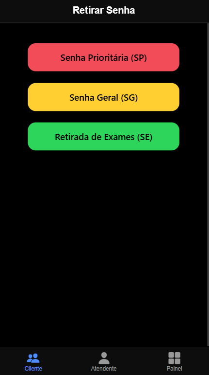
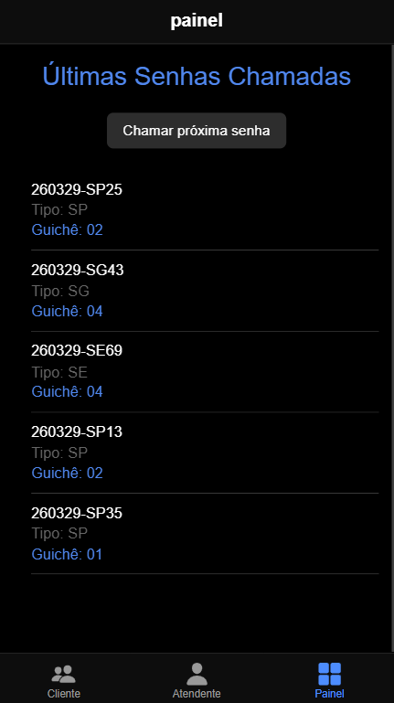
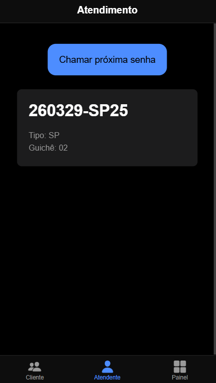

🏥 Sistema de Gerenciamento de Fila

Sistema de gerenciamento de senhas e atendimento desenvolvido com Angular + Ionic.
O projeto simula um ambiente real de triagem, como hospitais e bancos, com geração de senhas, organização de filas e painel de chamadas.

⚙️ Funcionalidades

Geração de senhas automáticas (SP - Prioritária, SG - Geral, SE - Exames)
Organização de fila com prioridade de atendimento
Painel com exibição das últimas senhas chamadas
Atendimento por guichê
Feedback sonoro ao chamar senha 🔊

🧠 Como funciona

O cliente gera uma senha na aba “Cliente”
A senha entra na fila automaticamente
O atendente chama a próxima senha disponível
O painel exibe a senha chamada e o guichê

🖥️ Telas do Sistema

📌 Cliente
Área onde o usuário retira sua senha.

📌 Painel
Exibe as últimas senhas chamadas pelo sistema.

📌 Atendente
Interface onde o atendente chama as senhas.

🛠️ Tecnologias Utilizadas
Angular
Ionic Framework
TypeScript
HTML5
SCSS

🎯 Objetivo do Projeto
Projeto acadêmico com foco em:

Manipulação de estado
Comunicação entre componentes
Desenvolvimento com Angular
Criação de interfaces responsivas
📂 Estrutura de Pastas
src/
├── app/
│ ├── tabs/
│ │ ├── cliente/
│ │ ├── painel/
│ │ ├── atendente/
│ ├── services/
│ ├── models/
│
├── assets/
│ ├── img/

🚀 Como rodar o projeto
npm install
ionic serve

📌 Autor
Güiniwer Buñol - Projeto desenvolvido para fins acadêmicos e portfólio.